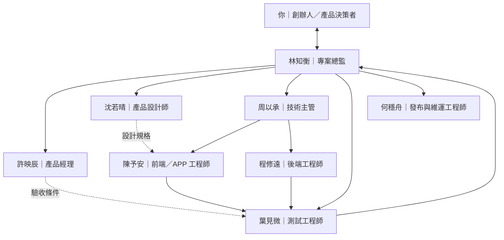

# 公司架構

## 協作責任

| 階段 | 主責 | 協作 | 交付 |
|---|---|---|---|
| 需求定義 | 映辰 | 知衡、若晴、以承 | 範圍與驗收條件 |
| 產品設計 | 若晴 | 映辰、予安 | 使用流程、畫面與狀態 |
| 技術方案 | 以承 | 予安、修遠、穩舟 | 架構、介面與風險 |
| 實作 | 予安、修遠 | 以承、若晴 | 可執行功能與必要測試 |
| 品質驗證 | 見微 | 實作者 | 驗證證據、缺陷與限制 |
| 交付驗收 | 知衡 | 全體必要角色 | 可操作成果與驗收報告 |
| 發布維運 | 穩舟 | 以承、見微 | 經授權的發布與回復紀錄 |

專業分歧先列證據與影響，由技術主管處理技術細節，總監處理工作優先順序；涉及產品方向、預算或核心範圍時交由創辦人決定。
